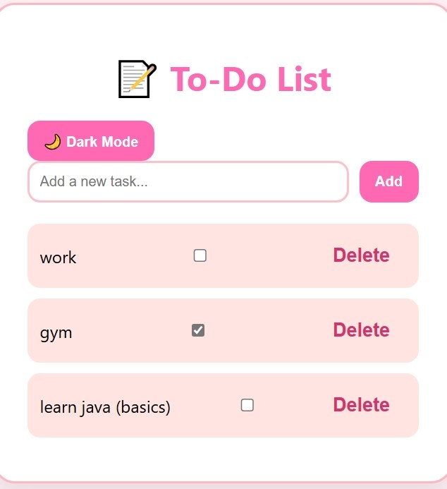

# 📝 To-Do List App

A simple and cute to-do list web app built with HTML, CSS, and JavaScript.

## ✨ Features

- Add new tasks
- Set a due date
- Mark tasks as complete with checkboxes
- Delete tasks
- Save tasks in browser (localStorage)
- Toggle dark mode

## 🚀 How to Use

1. Download or clone the project
2. Open `index.html` in your browser
3. Start adding tasks!

## 🌸 Author

Made with 💖 by Aya Zkara  
📧 zkaraaya1@gmail.com

